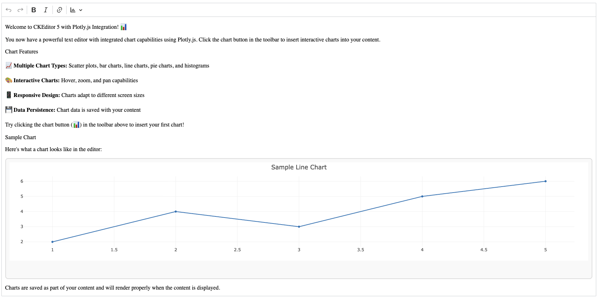

# CKEditor # Plotly.js Widget showcase

This project demonstrates a successful integration of Plotly.js chart library with CKEditor 5, allowing users to insert interactive charts directly into their content.



## Features

### 🎯 **Chart Types Supported**
- **Scatter Plot**: Data points with optional trend lines
- **Bar Chart**: Vertical bar representations
- **Line Chart**: Connected data points
- **Pie Chart**: Circular statistical graphics
- **Histogram**: Distribution visualization

### 🎨 **Interactive Capabilities**
- **Hover Effects**: Detailed data tooltips
- **Zoom & Pan**: Navigate through large datasets
- **Responsive Design**: Auto-resize with container
- **Data Persistence**: Chart configuration saved with content

### 🔧 **Editor Integration**
- **Toolbar Button**: Easy chart insertion via dropdown
- **Widget System**: Charts as first-class editor objects
- **Sample Data**: Pre-configured examples for each chart type
- **Visual Feedback**: Clear chart boundaries and selection

## Project Structure

```
├── src/
│   ├── index.js                          # Main editor configuration
│   └── plugins/
│       └── plotly-chart/
│           ├── plotlychart.js            # Master plugin
│           ├── plotlychartediting.js     # Model/view conversion
│           ├── plotlychartui.js          # Toolbar & UI components
│           ├── plotlyrenderer.js         # Chart rendering logic
│           └── plotlychart.css           # Widget styling
├── dist/
│   └── bundle.js                         # Compiled editor bundle
├── index.html                            # Demo page
├── main.js                               # Editor initialization
└── package.json                          # Dependencies & scripts
```

## Usage

1. **Start the development server**:
   ```bash
   npm start
   ```

2. **Insert charts**:
   - Click the chart button (📊) in the toolbar
   - Select from 5 different chart types
   - Chart appears with sample data

3. **Customize charts**:
   - Edit chart data attributes in the HTML output
   - Modify chart configuration via the data attributes

## Technical Implementation

### Plugin Architecture
- **Master Plugin**: Coordinates editing and UI components
- **Editing Plugin**: Handles model-to-view conversion using CKEditor 5's widget system
- **UI Plugin**: Provides toolbar dropdown with chart type selection
- **Renderer**: Manages Plotly.js chart creation and cleanup

### Data Storage
Charts are stored as HTML elements with data attributes:
```html
<div class="plotly-chart" 
     data-chart-data='{"x": [1,2,3], "y": [2,4,3], "type": "scatter"}'
     data-chart-type="scatter"
     data-chart-title="Sample Chart">
</div>
```

### Dependencies
- **CKEditor 5**: Modern rich text editor framework
- **Plotly.js**: Interactive charting library
- **Webpack**: Module bundler for custom builds

## Next Steps

The integration provides a solid foundation for chart editing capabilities. Future enhancements could include:

- **Chart Editor Dialog**: Visual interface for data input
- **Data Import**: CSV/JSON file support
- **Advanced Chart Types**: 3D plots, financial charts, geographic maps
- **Theme Integration**: Match editor styling
- **Export Options**: Save charts as images

## Development

- **Build**: `npm run build`
- **Watch**: `npm run build:dev`
- **Serve**: `npm start`
